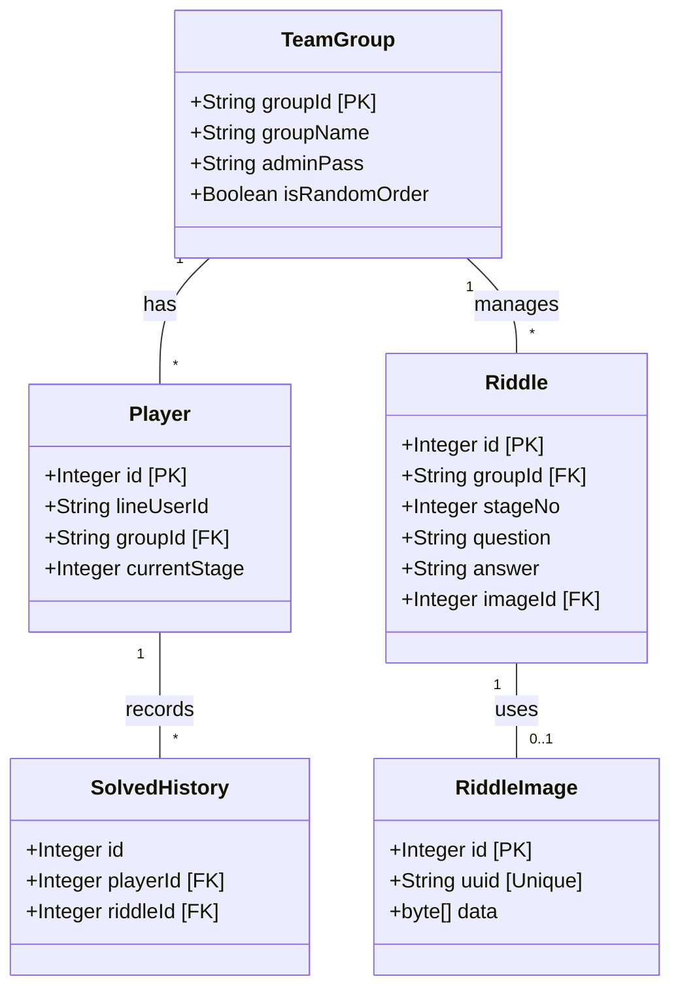
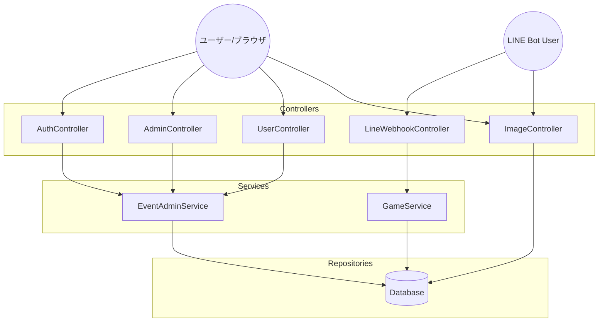

# 謎解きイベントプラットフォーム 設計書 (MysteryBot)

## 1. 概要 (Overview)
LINE Botを活用した、周遊型・イベント型謎解きゲーム作成プラットフォーム。
「グループID（テナント）」を分けることで、1つのシステムで複数の企業やイベント（結婚式余興、社内レクリエーションなど）を同時に稼働させることを可能とする。
Webブラウザ上で動作する管理画面を提供し、SQLを操作せずにイベントの開設や謎の登録を可能にする。

## 2. 要件定義 (Requirements)

### 2.1 ターゲットユーザー
1.  **アプリ管理者 (Super Admin):** プラットフォーム全体の管理者。全イベントの監視・管理権限を持つ。
2.  **イベント主催者 (Organizer):** 謎解きイベントを主催する幹事。自身のイベントのシナリオ作成・進行管理を行う。
3.  **プレイヤー (Player):** LINEを使って謎解きに参加する一般ユーザー。

### 2.2 機能要件
#### 【アプリ管理者機能】 (`/admin`)
* **全イベント管理:** 稼働中の全イベント一覧表示、強制削除。
* **ゴッドログイン (God Login):** パスワードなしで任意のイベント管理画面へログインし、代理操作を行う。
* **カタログ管理:** 全イベントで共有可能な「マスター問題」の登録・管理。

#### 【イベント主催者機能】 (`/user`)
* **ダッシュボード:** イベントの状態確認、開始操作、参加用QRコードの表示。
* **シナリオ編集 (CRUD):**
    * 問題文、正解、ヒント、画像、次メッセージの登録・編集。
    * 画像アップロード時、自動的にリサイズ・軽量化を行う。
    * 「カタログ」からの問題インポート機能。
* **設定変更:** 出題順（順番通り/ランダム）の切り替え。
* **進捗確認:** ランキングボード（リアルタイム順位表）の表示。

#### 【プレイヤー機能】 (LINE Bot)
* **ゲーム開始:** 「開始 [イベントID]」コマンドによるゲーム参加。
* **回答送信:** LINEトーク画面での回答入力。
* **正誤判定:** Botによる自動判定と即時返信（正解時は次の問題/画像を送信）。
* **ヒント機能:** 「ヒント」と送ることで設定されたヒントを閲覧可能。
* **途中再開:** 進行状況の自動保存。
* **遊び方ガイド:** 「遊び方」や「ヘルプ」コマンドでのガイド表示。

### 2.3 非機能要件
* **レスポンス:** LINE返信の即応性。
* **セキュリティ:**
    * 管理画面: セッションベースのログイン認証。権限によるURLアクセス制御。
    * 画像アクセス: 推測不可能なUUIDを使用した公開URL (`/public/image/{uuid}`) を採用し、連番IDによる不正閲覧（ネタバレ）を防止する。

---

## 3. 基本設計 (Basic Design)

### 3.1 アーキテクチャ
* **Backend:** Java 21, Spring Boot
* **Frontend:** Thymeleaf, Bootstrap 5 (Server-Side Rendering)
* **Database:** MySQL 8.0 (Docker / TiDB Serverless)
* **ORM:** MyBatis
* **Messaging:** LINE Messaging API (Webhook / Flex Message)

### 3.2 ディレクトリ構成 (Controller層)
URLプレフィックスにより役割を明確に分離する。

| Role | Prefix | Controller Class | Description |
| :--- | :--- | :--- | :--- |
| **認証** | `/auth` | `AuthController` | ログイン、ログアウト、新規登録 |
| **管理者** | `/admin` | `AdminController` | 全体管理、マスタ管理、ゴッドログイン |
| **主催者** | `/user` | `UserController` | イベント管理、シナリオ編集、ランキング |
| **Bot** | `/callback` | `LineWebhookController` | LINE Webhookの受信・処理 |
| **画像** | `/public` | `ImageController` | 画像配信 (認証不要・UUIDアクセス) |

---

## 4. テーブル設計 (Schema Design)

### ER図 (概要)
* `team_groups` (1) --- (N) `riddles`
* `team_groups` (1) --- (N) `players`
* `players` (1) --- (N) `solved_histories`
* `riddles` (N) --- (1) `riddle_images` (Optional)

### 4.1 team_groups (イベント管理)
| Column | Type | Description |
| :--- | :--- | :--- |
| `group_id` | VARCHAR(PK) | イベントID (例: wedding2024) |
| `group_name` | VARCHAR | イベント名 |
| `admin_pass` | VARCHAR | 管理用パスワード |
| `is_random_order` | BOOLEAN | ランダム出題モードフラグ |
| `started_at` | DATETIME | イベント開始日時 (nullなら準備中) |

### 4.2 riddles (シナリオデータ)
| Column | Type | Description |
| :--- | :--- | :--- |
| `id` | INT(PK) | 自動採番 |
| `group_id` | VARCHAR(FK) | 所属イベント |
| `stage_no` | INT | 出題順序 |
| `question` | TEXT | 問題文 |
| `answer` | VARCHAR | 正解 (カンマ区切りで複数可) |
| `hint_msg` | VARCHAR | ヒントメッセージ |
| `next_msg` | TEXT | 正解時のメッセージ |
| `image_id` | INT(FK) | 画像ID (riddle_images参照) |

### 4.3 players (参加者)
| Column | Type | Description |
| :--- | :--- | :--- |
| `id` | INT(PK) | 自動採番 |
| `line_user_id` | VARCHAR | LINE User ID |
| `group_id` | VARCHAR(FK) | 参加イベント |
| `current_stage` | INT | 現在の進行度 |
| `player_name` | VARCHAR | チーム名/個人名 |
| `start_at` | DATETIME | 開始時刻 |
| `finished_at` | DATETIME | 全問クリア時刻 |
| `current_riddle_id`| INT | 現在挑戦中の問題ID（ランダムモード用）|

### 4.4 riddle_images (画像ストレージ)
| Column | Type | Description |
| :--- | :--- | :--- |
| `id` | INT(PK) | 内部管理ID (JOIN用) |
| `uuid` | VARCHAR(36) | **公開用ID (URLに使用)** |
| `data` | LONGBLOB | 画像バイナリデータ |
| `mime_type` | VARCHAR | MIMEタイプ (image/jpeg等) |

### 4.5 master_riddles (カタログ用マスタ)
| Column | Type | Description |
| :--- | :--- | :--- |
| `id` | INT(PK) | マスタID |
| `category` | VARCHAR | カテゴリ (初級, 結婚式等) |
| `question`... | - | 問題データ一式 |

---

## 5. エンドポイント設計 (Endpoints)

### 5.1 認証 (`AuthController`)
* `GET /auth/login` : ログイン画面
* `POST /auth/login` : ログイン処理
* `GET /auth/register` : 新規イベント作成画面
* `POST /auth/register` : イベント作成処理

### 5.2 アプリ管理者 (`AdminController`)
* `GET /admin/dashboard` : 統合管理ダッシュボード
* `POST /admin/impersonate/{groupId}` : 指定イベントへなりすましログイン
* `POST /admin/delete/{groupId}` : イベント強制削除
* `POST /admin/catalog/add-master` : カタログへの問題登録

### 5.3 イベント主催者 (`UserController`)
* `GET /user/dashboard` : イベント管理トップ
* `POST /user/start-event` : イベント本番開始
* `GET /user/riddles` : シナリオ一覧
* `POST /user/riddles/add` : 謎の新規登録 (画像Upload含む)
* `POST /user/riddles/update` : 謎の更新
* `GET /user/ranking` : リアルタイムランキング表示
* `GET /user/catalog` : カタログ一覧表示
* `POST /user/catalog/import` : カタログから自イベントへコピー

### 5.4 画像配信 (`ImageController`)
* `GET /public/image/{uuid}` : 画像データの配信 (UUIDによるアクセス)

---

## 6. クラス設計 (主要コンポーネント)

### Controller
* **`AuthController`**: 認証とセッション管理。
* **`AdminController`**: スーパーAdmin操作。
* **`UserController`**: 一般主催者の操作。
* **`LineWebhookController`**: LINE Botのリクエスト処理。
* **`ImageController`**: 画像バイナリの配信。

### Service
* **`EventAdminService`**: 管理画面側の全ロジック（CRUD、画像UUID発行、認証等）。
* **`GameService`**: Bot側のゲーム進行ロジック。

### Util
* **`FlexMessageHelper`**: LINE Flex Message JSONへの変換（UUIDベースのURL生成を含む）。

---

## 7. システム構成図 (Diagrams)

### 7.1 エンティティ関係図 (ER Diagram Class View)
データベースのテーブルと対応するエンティティの関係。

### 7.2 アプリケーション構造 (Controller & Service)

