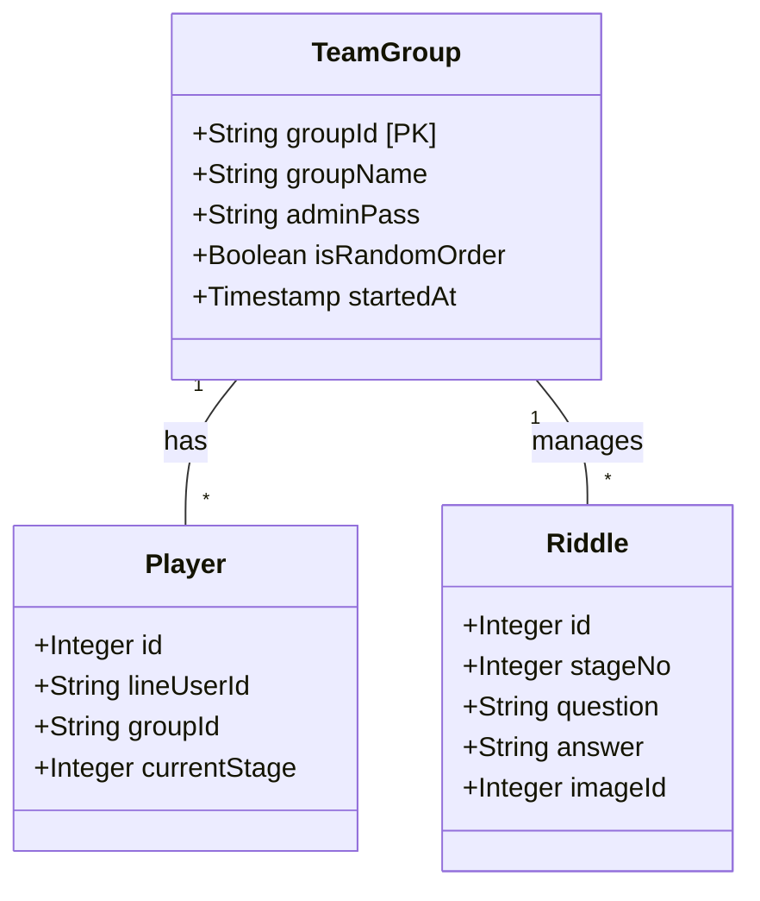
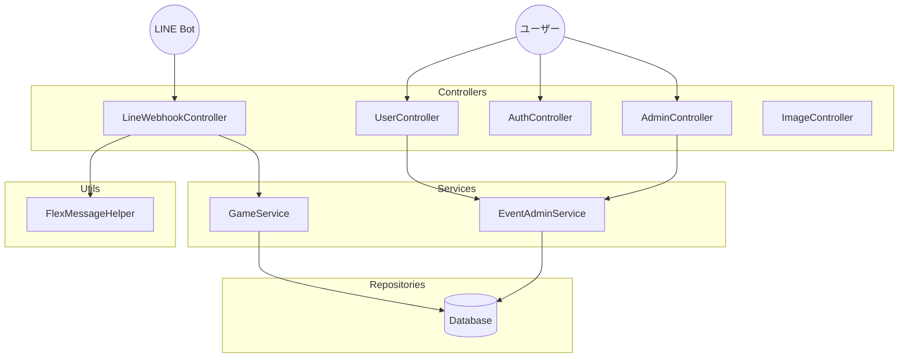

# 謎解きイベントプラットフォーム 設計書 (MysteryBot)

## 1. 概要 (Overview)

LINE Bot を活用した、周遊型・イベント型謎解きゲーム作成プラットフォーム。
「グループ ID（テナント）」を分けることで、1 つのシステムで複数の企業やイベント（結婚式余興、社内レクリエーションなど）を同時に稼働させることを可能とする。

## 2. 要件定義 (Requirements)

### 2.1 ターゲットユーザー

1.  **アプリ管理者 (Super Admin):** プラットフォーム全体の管理者。全イベントの監視・管理権限を持つ。
2.  **イベント主催者 (Organizer):** 謎解きイベントを主催する幹事。自身のイベントのシナリオ作成・進行管理を行う。
3.  **プレイヤー (Player):** LINE を使って謎解きに参加する一般ユーザー。

### 2.2 機能要件

#### 【アプリ管理者機能】 (`/admin`)

- **全イベント管理:** 稼働中の全イベント一覧表示、強制削除。
- **ゴッドログイン (God Login):** パスワードなしで任意のイベント管理画面へログインし、代理操作を行う。
- **カタログ管理:** 全イベントで共有可能な「マスター問題」の登録・管理。
- **強制リセット:** 進行中のイベント時間をリセットし、「準備中」の状態に戻す。

#### 【イベント主催者機能】 (`/user`)

- **ダッシュボード:** イベントの状態確認、開始操作、参加用 QR コードの表示。
- **シナリオ編集 (CRUD):**
  - 問題文、正解、ヒント、画像、次メッセージの登録・編集。
  - **カタログインポート:** 管理者が作成した既成問題を自身のイベントに取り込む。
  - **レスポンシブUI:** スマホ・PC両対応の管理画面。
- **設定変更:** ランダム出題モードの切り替え。
- **ランキング:** 参加者のクリアタイムをリアルタイムでランキング表示。

#### 【プレイヤー機能】 (LINE Bot)

- **ゲーム開始:** 「開始 [イベント ID]」コマンドによるゲーム参加。
- **回答送信:** LINE トーク画面での回答入力。
- **正誤判定:** Bot による自動判定と即時返信（正解時は次の問題/画像を送信）。
- **ヒント機能:** 「ヒント」コマンドでヒントを表示。
- **遊び方ガイド:** 「遊び方」「ヘルプ」コマンドでガイドを表示。
- **制限時間:** イベント開始から **24時間** が経過すると、自動的に回答を受け付けなくなりイベント終了となる。

## 3. 基本設計 (Basic Design)

### 3.1 アーキテクチャ

- **Backend:** Java 21, Spring Boot
- **Frontend:** Thymeleaf, Bootstrap 5
- **Database:** MySQL 8.0 (TiDB Serverless)
- **ORM:** MyBatis
- **Messaging:** LINE Messaging API (Flex Message)

### 3.2 ディレクトリ構成 (Controller 層)

URL プレフィックスにより役割を明確に分離する。

| Role       | Prefix      | Controller Class        | Description                            |
| :--------- | :---------- | :---------------------- | :------------------------------------- |
| **認証**   | `/auth`     | `AuthController`        | ログイン、ログアウト、新規登録         |
| **管理者** | `/admin`    | `AdminController`       | 全体管理、カタログ管理、リセット       |
| **主催者** | `/user`     | `UserController`        | イベント管理、シナリオ編集、ランキング |
| **Bot**    | `/callback` | `LineWebhookController` | LINE Webhook の受信・処理              |
| **画像**   | `/public`   | `ImageController`       | 画像配信 (認証不要・UUID アクセス)     |

---

## 4. テーブル設計 (Schema Design)

### 4.1 team_groups (イベント管理)

| Column            | Type        | Description                        |
| :---------------- | :---------- | :--------------------------------- |
| `group_id`        | VARCHAR(PK) | イベント ID (例: wedding2024)      |
| `group_name`      | VARCHAR     | イベント名                         |
| `admin_pass`      | VARCHAR     | 管理用パスワード                   |
| `is_random_order` | BOOLEAN     | ランダム出題モードフラグ           |
| `started_at`      | TIMESTAMP   | イベント開始日時 (null なら準備中) |

### 4.2 riddles (シナリオデータ)

| Column     | Type        | Description                  |
| :--------- | :---------- | :--------------------------- |
| `id`       | INT(PK)     | 自動採番                     |
| `group_id` | VARCHAR(FK) | 所属イベント                 |
| `stage_no` | INT         | 出題順序                     |
| `question` | TEXT        | 問題文                       |
| `answer`   | VARCHAR     | 正解 (カンマ区切りで複数可)  |
| `hint_msg` | VARCHAR     | ヒントメッセージ             |
| `next_msg` | TEXT        | 正解時のメッセージ           |
| `image_id` | INT(FK)     | 画像 ID (riddle_images 参照) |

### 4.3 players (参加者)

| Column          | Type        | Description     |
| :-------------- | :---------- | :-------------- |
| `id`            | INT(PK)     | 自動採番        |
| `line_user_id`  | VARCHAR     | LINE User ID    |
| `group_id`      | VARCHAR(FK) | 参加イベント    |
| `current_stage` | INT         | 現在の進行度    |
| `player_name`   | VARCHAR     | チーム名/個人名 |
| `start_at`      | DATETIME    | 開始時刻        |
| `finished_at`   | DATETIME    | 全問クリア時刻  |

### 4.4 riddle_images (画像ストレージ)

| Column      | Type        | Description                 |
| :---------- | :---------- | :-------------------------- |
| `id`        | INT(PK)     | 内部管理 ID                 |
| `uuid`      | VARCHAR(36) | **公開用 ID (URL に使用)**  |
| `data`      | LONGBLOB    | 画像バイナリデータ          |
| `mime_type` | VARCHAR     | MIME タイプ (image/jpeg 等) |

### 4.5 master_riddles (カタログ用マスタ)

| Column     | Type    | Description                  |
| :--------- | :------ | :--------------------------- |
| `id`       | INT(PK) | マスタ ID                    |
| `category` | VARCHAR | カテゴリ (初級, 結婚式等)    |
| `question` | TEXT    | 問題文                       |
| `answer`   | VARCHAR | 正解                         |
| `next_msg` | TEXT    | 正解メッセージ               |
| `hint_msg` | VARCHAR | ヒント                       |
| `image_id` | INT     | 画像 ID (riddle_images 参照) |

---

## 5. エンドポイント設計 (主要API)

### アプリ管理者 (`AdminController`)

- `POST /admin/impersonate/{groupId}` : 指定イベントへなりすましログイン
- `POST /admin/reset-time/{groupId}` : イベント開始時間の強制リセット
- `POST /admin/catalog/add-master` : カタログへの問題登録

### イベント主催者 (`UserController`)

- `POST /user/start-event` : イベント本番開始 (24hカウントダウン開始)
- `POST /user/riddles/add` : 謎の新規登録 (画像 Upload 含む)
- `POST /user/catalog/import` : カタログから自イベントへコピー
- `GET /user/ranking` : リアルタイムランキング表示

---

## 6. システム構成図 (Diagrams)

### 6.1 クラス設計概要 (Class Diagram)

### 6.2 アプリケーション構造 (Controller & Service)

