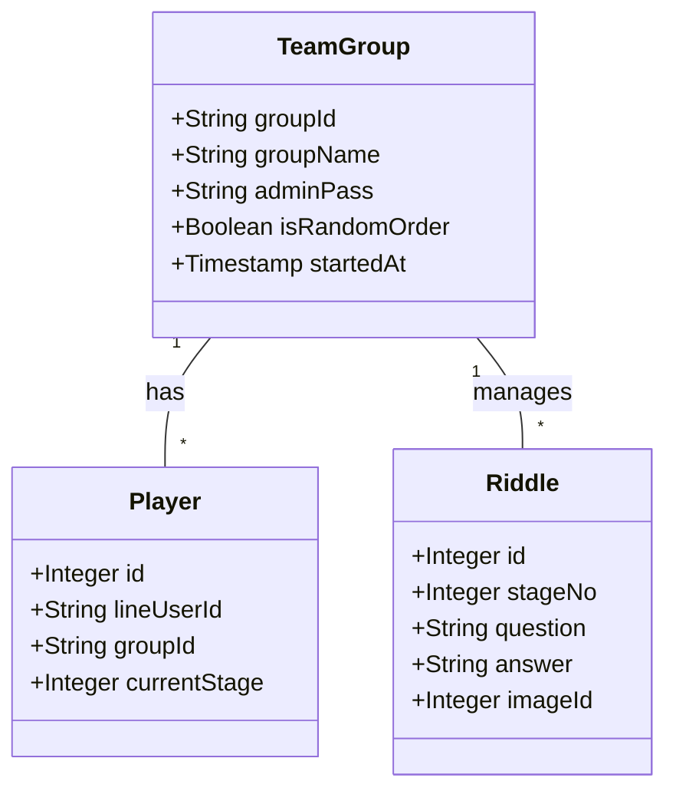
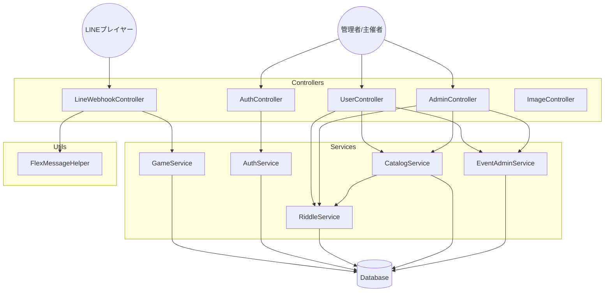

# アーキテクチャ設計 — MysteryBot

## 1. 技術スタック

| 項目 | 内容 |
|:--|:--|
| 言語 | Java 21 |
| フレームワーク | Spring Boot 4.0.1 / Spring Security 7.x |
| ORM | MyBatis（XMLマッパー方式） |
| テンプレート | Thymeleaf + Bootstrap 5 |
| DB（ローカル） | MySQL 8.0（Docker、ポート 3307） |
| DB（本番） | TiDB Serverless（MySQL互換） |
| 外部API | LINE Messaging API（Flex Message） |
| ビルド | Gradle 9.x |
| ホスティング | Render（GitHub push で自動デプロイ） |

---

## 2. レイヤー構成

```
Controller → Service → Repository → DB（MyBatis XML）
                ↓
           FlexMessageHelper → LINE Messaging API
```

### コントローラー層

URL プレフィックスでロールを分離する。

| ロール | プレフィックス | クラス | 説明 |
|:--|:--|:--|:--|
| 認証 | `/auth` | `AuthController` | ログイン・ログアウト・新規登録 |
| 管理者 | `/admin` | `AdminController` | 全体管理・カタログ管理・リセット |
| 主催者 | `/user` | `UserController` | イベント管理・シナリオ編集・ランキング |
| LINE Bot | `/callback` | `LineWebhookController` | LINE Webhook の受信・処理 |
| 画像 | `/public` | `ImageController` | 画像配信（認証不要・UUID アクセス） |

### サービス層

| クラス | 責務 |
|:--|:--|
| `AuthService` | ログイン・BCrypt認証・イベント登録（予約語チェック・パスワードハッシュ化） |
| `RiddleService` | リドルCRUD・画像アップロード（マジックバイト検証・リサイズ）・IDOR チェック |
| `CatalogService` | マスター問題CRUD・カタログからのインポート（`RiddleService` に委譲） |
| `EventAdminService` | イベント取得・ランキング・開始/設定変更・削除・時間リセット |
| `GameService` | LINE Bot のゲーム進行ロジック（参加・回答判定・ヒント・リセット） |

### 認証方式

- セッションベース（`HttpSession` に `loginGroupId` を格納）
- `groupId == "admin"` でスーパーAdmin 権限
- Spring Security `SecurityFilterChain` で CSRF 保護（`/callback` のみ除外）
- `AuthInterceptor`（`HandlerInterceptor`）が `/user/**` と `/admin/**` を一元ガード（コントローラーの重複認証チェックを排除）

---

## 3. ディレクトリ構成

```
src/main/java/com/gantaro/mysterybot/
├── config/
│   ├── SecurityConfig.java                                  # Spring Security 設定
│   ├── AuthInterceptor.java                                 # 認証・認可インターセプター（/user/**, /admin/**）
│   ├── WebConfig.java                                       # HandlerInterceptor 登録
│   └── LineBotAutoConfigurationEnvironmentPostProcessor.java # LINE SDK 起動制御
├── controller/
│   ├── AdminController.java        # スーパーAdmin 用
│   ├── AuthController.java         # 認証
│   ├── ImageController.java        # 画像配信
│   ├── LineWebhookController.java  # LINE Webhook
│   └── UserController.java         # イベント主催者用
├── service/
│   ├── AuthService.java            # ログイン・イベント登録
│   ├── CatalogService.java         # マスター問題CRUD・インポート
│   ├── EventAdminService.java      # イベント管理・ランキング
│   ├── GameService.java            # ゲーム進行ロジック
│   └── RiddleService.java          # リドルCRUD・画像アップロード
├── entity/                         # DB エンティティ
├── repository/                     # MyBatis リポジトリ
├── dto/
│   └── GameResult.java
└── util/
    └── FlexMessageHelper.java      # LINE メッセージ生成

src/main/resources/
├── application.properties          # 共通設定（シークレットは環境変数注入、コミット済み）
├── schema.sql                      # DDL
├── mappers/                        # MyBatis XML マッパー
└── templates/                      # Thymeleaf テンプレート
    ├── admin/
    ├── auth/
    └── user/
```

---

## 4. 構成図

### クラス関係図



### アプリケーション構造



---

## 5. ゲームフロー（LINE Bot）

```
プレイヤー「開始 wedding2024」
    → joinGame() → チーム名入力を促す
プレイヤー「さくらチーム」
    → processAnswer() → 名前登録、第1問送信
プレイヤー「答え」
    → processAnswer() → 正誤判定 → 正解なら次問
    → 全問正解 → finished_at 記録、ランキング反映
プレイヤー「ヒント」
    → getHint() → ヒント返信
プレイヤー「リセット」
    → resetGame() → プレイヤーデータ削除
```

制限時間: `team_groups.started_at` から 24 時間で自動締め切り

---

## 6. 画像配信の仕組み

- 画像は DB（`riddle_images.data`）に LONGBLOB で保存
- アップロード時に UUID を生成し、公開 URL は `/public/image/{uuid}`
- 認証不要エンドポイント（LINE Bot からアクセスできるよう Basic 認証なし）
- アップロード時に Thumbnailator で 800px 幅・JPEG 80% 品質にリサイズ
